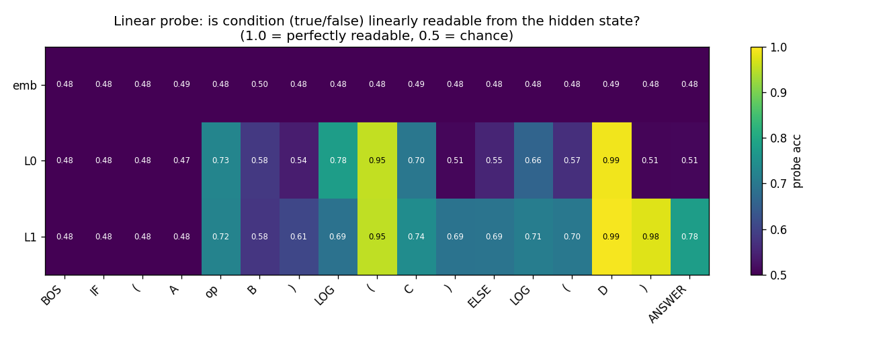
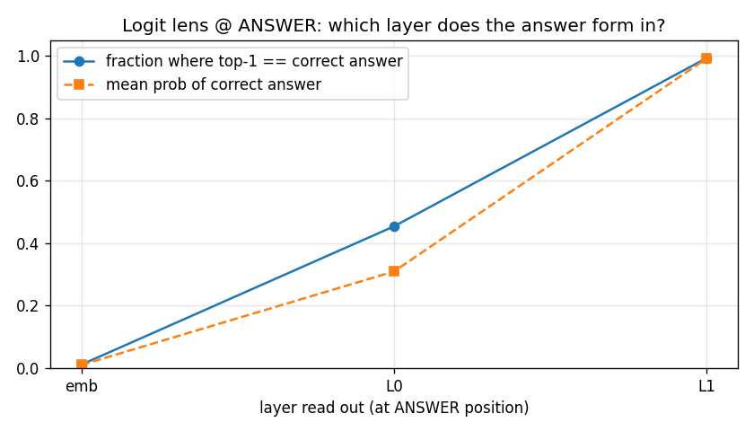
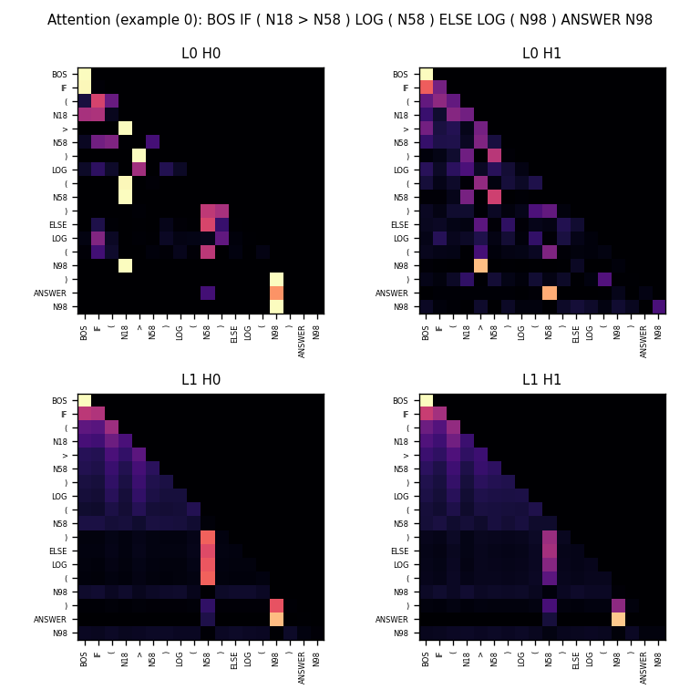

# TinyLogicLM

用一个**极小的 decoder-only Transformer**(约 12.7 万参数)去"执行"一门自造的极简符号语言,
然后用可解释性工具(linear probe / logit lens / attention)打开它,看它**内部到底是怎么算出答案的**。

这是一个学习性质的项目:目标不是刷指标,而是**理解 Transformer**。所以模型刻意做小,用到的概念
全部来自 [The Illustrated Transformer](https://jalammar.github.io/illustrated-transformer),不加复杂技巧。

---

## 任务:让模型执行一段代码

V1 的语言只有一条 if-else 语句:

```
if (A op B) log(C) else log(D)        op ∈ { >, < },  A B C D ∈ 0..99
```

条件为真输出 `C`,否则输出 `D`。模型要学会:**比较 A 和 B → 选对分支 → 输出对应的数**。

**输入 / 输出**(喂给模型的是离散 token,一个数字一个 token,语法符号各占一个 token):

```
输入:  BOS IF ( N18 > N58 ) LOG ( N58 ) ELSE LOG ( N98 ) ANSWER
输出:  N98 EOS                     # 18 > 58 为假 → 走 else → 输出 D=98
```

> 为什么用离散 token 而不是裸 0-9 / 0-1 字符流?因为那样会把"学分词"和"学逻辑"耦合在一起,
> 难训练也难分析。这里让模型专注于逻辑本身。

---

## 模型结构

标准 **decoder-only Transformer**(GPT 式),每个组件都能对应到 Illustrated Transformer:

| Illustrated Transformer 里的概念 | 本项目代码 |
|---|---|
| 词向量 Embedding | `token_emb` |
| 位置向量(加到词向量上) | `pos_emb` |
| Self-Attention:Q/K/V + 缩放点积 + softmax | `CausalSelfAttention` |
| Multi-Head Attention | 多头拆分 |
| Add & Normalize(残差 + LayerNorm,子层后) | `TransformerBlock`(Post-LN) |
| 前馈网络 Linear → ReLU → Linear | `TransformerBlock.mlp` |
| 最后 Linear + Softmax 出词 | `lm_head` + cross-entropy |

**超参**:`d_model=64`,`2` 层,`2` 头,`d_ff=256`,词表 `200`,上下文 `32` → **共 127,744 参数**。
越小越好训练,也越容易做电路级别的可解释性。

---

## 训练方式

- **decoder-only causal LM**:每个位置预测下一个 token。
- **loss 只算 `ANSWER` 之后的部分**(前面的程序 token 用 mask 屏蔽)——等价于 SFT 里的 prompt / completion。
- 优化器用**朴素 Adam**(lr `1e-3`,不加 weight decay 这种文章没讲的正则),20 万条样本,25 个 epoch。

**训练中出现了 grokking(顿悟)相变**:前几个 epoch 准确率死卡在 ~0.50(只会在 C/D 之间瞎猜),
然后**某一个 epoch 突然学会比较**,跳到 0.95+,最终 ~0.99。

```
epoch 0-4   val_acc ≈ 0.50     ← 只知道答案是 C 或 D 之一, 不会算条件
epoch 5     val_acc = 0.92     ← 突然 grok
epoch 10+   val_acc ≈ 0.99
```

---

## 表现与效果

判定标准(**不算过拟合**):只要测试题的 `(A, B, op, C, D)` 组合没在训练集完整出现过,
答对就算真本事。为此专门做了两层泛化测试:

| 测试口径 | 准确率 |
|---|---|
| train-seen(训练里见过的题) | 0.998 |
| **novel-tuple(严格保证从没见过的题)** | **0.992** |
| holdout-pair(训练时整块排除的 A∈[20,29]&B∈[30,39]) | 0.983 |
| **过拟合 gap = train − novel** | **+0.006 ≈ 0** |

20 万条训练样本里有 19.99 万道互不相同;模型在**严格没见过**的题上仍有 99%,train/test 差仅 0.6%
→ 学到的是"比较 + 选择"的**算法**,不是死记硬背。目标 80%,远超达标。

---

## 打开黑盒:它内部是怎么算的

用 `tiny_logic/inspect.py` 生成三张图,拼出一条清晰的"两段式电路":**L0 算条件 → L1 拍板答案**。

### 1. Linear probe:条件真假在哪一层、哪个位置变得可读



在每一层、每个 token 位置训练一个探针预测 condition 真假。结论:
- **`emb` 层全是 ~0.5(随机)** → 原始词向量里不含大小信息;
- **`L0` 在条件读完后突然变可读(~0.99)** → 第 0 层就算完了 `A op B`;
- `L1` 全程可读。

### 2. Logit lens:答案在第几层成形



把每层 `ANSWER` 位置的隐向量直接送进 `lm_head`,看它此刻倾向哪个词:
- `emb` → 0.01,`L0` → 0.45,**`L1` → 0.99**。**答案是在最后一层才拍板的。**

### 3. Attention:信息从哪里搬来



L1 里 `ANSWER` 位置有一个明显的 **copy head**,直接把被选中的那个数字 token 的信息搬到输出位;
`ELSE` 位置则回头强烈关注被选中的数值。和上面探针 / logit lens 的结论完全一致。

---

## 延伸实验:把答案从 `C/D` 改成 `C+1 / D+1`

只改一处——答案 = `(选中的数 + 1) % 100`(`--answer plus1`)。这把任务从"**复制**"(答案就在输入里)
变成"**复制 + 计算后继**"(答案不在输入里)。

| | copy(复制) | plus1(复制+后继) |
|---|---|---|
| 答案在输入里吗 | 在 | **不在** |
| grok 时刻 | 约 epoch 5 | **约 epoch 10(更晚)** |
| novel-tuple 准确率 | 0.99 | 0.99 |
| 过拟合 gap | +0.005 | +0.002 |

**结论**:任务从"抄"变成"抄完再算一步",难度上升(grok 推迟),但只要那步计算是有限、可枚举的
(100 项后继表),小模型仍能学好且不过拟合。

### 一个漂亮的失败案例(QK 对、V 对,错在最后一步)

如果训练时**整段抽掉**某些值(比如 C/D 从不取 54–60),测试时模型在这些值上**完全崩(0%)**。
拆开看很有意思:

- **Q/K 对** → 注意力 93% 落在正确的 C/D 位置(该去哪抄,学对了,还泛化);
- **V 对** → 探针能 **99.9%** 从 `ANSWER` 隐向量里读出"选中的到底是哪个数",值被完整搬到了、也保留到最后一层;
- **错在 unembedding** → `lm_head` 里这些值的输出行**从没被训练过**,所以隐向量里明明带着正确答案,
  却没有一行能"叫出它的名字"。

一句话:**模型能泛化到"没见过的组合",但泛化不了"从没在输出侧出现过的值"** —— 这不是过拟合,
而是要求它外推从没观测过的东西。

---

## 用法

```bash
pip install -r requirements.txt

# 看数据
python -m tiny_logic.data -n 8

# 训练 (CPU/MPS 几分钟, 默认超参已能可靠 grok)
python -m tiny_logic.train                    # copy 任务
python -m tiny_logic.train --answer plus1     # plus1 任务
python -m tiny_logic.train --holdout-pair     # 训练时真排除一块区域, 做泛化测试

# 严格评估 (含"保证没见过"的题 + 过拟合 gap)
python -m tiny_logic.eval --ckpt checkpoints/tiny_logic.pt

# 可解释性图 (probe / logit lens / attention)
python -m tiny_logic.inspect --ckpt checkpoints/tiny_logic.pt
```

---

## 代码结构

```
tiny_logic/
  vocab.py     词表 + token 编解码
  data.py      数据生成 (copy/plus1, trace, holdout)
  model.py     TinyGPT (decoder-only, 可吐出各层激活)
  train.py     causal LM 训练 + masked loss
  eval.py      多口径评估 + 过拟合检查
  probe.py     linear probe (逻辑回归探针)
  inspect.py   probe / logit lens / attention 可视化
```

---

## 路线图

| 版本 | 输入形式 | 目标 | 状态 |
|---|---|---|---|
| **V1** | 语法 token + `NUM_n` | 学 if-else 执行 | ✅ |
| V1.5 | + `{}` 嵌套 | 学 branch skipping / 深度 | 计划 |
| V2 | 语法 token + digit(0-9) | 学数字结构 / 泛化 | 计划 |
| V3 / V4 | 纯十进制 / 二进制流 | 学 token 边界 + 执行 | stretch |
